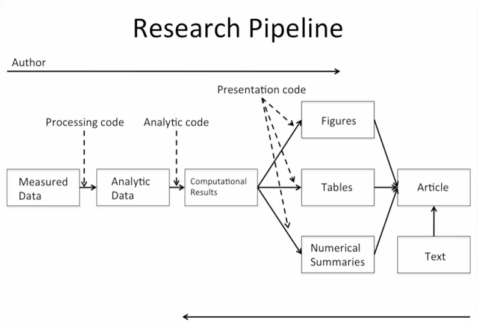

### Why do we need reproducible research?

- To bridge the gap between replication and nothing. We make available the data from studies, share our methods of analysis and allow others to validate / investigate our methods.
- This allows peers to at least validate thedata analysis, if not the study data. This gives confidence that correct analysis methods were used.
- Methods used / computational power have become a lot more sophisticated, meaning the analyses are more complex.

### Research Pipeline

## What do we need for reproducible research?

- Analytic data are available
- Analytic code are available
- Documentation of code and data (e.g. codebook)
- Standard means of distribution

#### Interested parties

- Authors: produce research. Want tools to make their lives easier.
- Readers: want to read the work, need tools to make reading easier.

## Literate programming

Think of an article as a stream of text and code chunks:

- Code chunks load data / computes results
- Presentation code formats results
- Article text explains what's going on

Programs can be *weaved* to produce human-readable documents and *tangled* to produce machine-readable documents.

It requires:
- A documentation language (human readable)
- A programming language (machine readable)

### Sweave - an early language in R, uses latex and R.

#### Limitations

- Not many know the language.
- Lacks caching, multiple plots per page
- Not actively developed

### Knitr

- Developed by Yihui Xie whilst a grad student.
- Uses R, LATEX, Markdown and htmls

## Scripting your analysis

... script everything

## Steps in a data analysis

#### 1) Define the question

1. Have a scientific context general question
2. Have a generally stated question and valid data
3. Apply appropriate statistical method to the data.

Start with a general question:
"Can I automatically detect emails that are SPAM and those that aren't?"

Make it concrete
"Can I use quantitative characteristics of the emails to classify them as SPAM?"

#### 2) Define the ideal data set

This will depend on your goal:

- Descriptive - a whole population
- Exploratory - a random sample with many variables measured
- Inferential - the right population, randomly sampled
- Predictive - a training and test data set from the same population
- Causal - experimental data from a randomized study
- Mechanistic - data about all components of the system

#### 3) Determine what data you can access

Maybe free data on the web, or maybe you need to buy data. You might even need to generate the data yourself.

e.g. in our example, the spambase dataset from UCI machine learning repository.

#### 4) Obtain the data

- Try to obtain the raw data.
- Be careful to reference the source.
- If loading from the internet, record the url and time / date accessed.

#### 5) Clean the data

- If the data is pre-processed, make sure you know how.
- Understand the data source, how it was collected, was sampling applied?
- May need reformatting / subsampling - record these steps.
- Determine if the data are good enough. If not, pivot / quit.

#### 6) Exploratory data analysis

- Look at summaries of the data
- Check for missing data
- Create exploratory plots
- Perform exploratory analyses

#### 7) Statistical prediction / modelling

- Should be informed by the results of exploratory analysis.
- Exact methods depend on the question of interest.
- Transformations / processing should be accounted for as necessary.
- Measures of uncertainty should be reported.

#### 8) Interpret results

- Use appropriate language: describe, correlate with / associate with, leads to / causes, predicts.
- Give an explanation
- Interpret coefficients
- Interpret measures of uncertainty

e.g.: "The fraction of characters that are dollars signs can be used to predict if an email is spam. Anything with more than 6.6% dollar signs is classified as spam. More dollar signs always means more spam under our prediction. Our test set error rate was 22.4%."

#### 9) Challenge results

- Challenge all your steps
  - Question: is it valid?
  - Data source: was it processed / cleaned correctly?
  - Processing
  - Analysis
  - Conclusions
- Challenge  measures of uncertainty
- Were valid choices of model terms made?
- What alternatives could we consider?

#### 10) Synthesize / write up results

- Lead with the question
- Summarise the analyses into the story
- Don't include every analysis - include it
  - if it is needed for the story
  - if it is needed to address a challenge
- Order analyses according to the story, rather than chronologically.
- Include 'pretty' figures that contribute to the story.

#### 11) Create reproducible code
