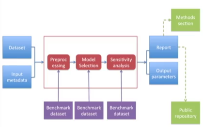

## Communicating results

[Getting email responses from busy people](http://simplystatistics.org/2011/09/23/getting-email-responses-from-busy-people/)

Use a hierarchy of information to present - good old inverted pyramid.

- Title/ author list
- Abstract (approx 100 words)
- Body / results
- Supplementary materials / gory details
- Code / data / really gory details

#### Email presentation hierarchy

Body

- A brief description of the problem / context; recall what was proposed / executed. Summarise findings / results; 1-2 paragraphs.
- If action should be taken as a result of this presentation, suggest some options and make them as concrete as possible.
- If questions need to be addressed, make them yes / no.

## Reproducible research checklist

- Coherent, focused questions simplify problems.
- Work with good collaborators to reinforce good practice.

#### DON'T 

- Do things by hand e.g. removing outliers, editing in excel, editing tables / figures.
- Moving / splitting data files on your computer without documenting how they  have been changes.
- Beware thinking "we'll just do this once".
- Avoid point and click software with GUIs. Ease of use leads to non-reproducible analyses.

#### DO

- Teach a computer to do it. e.g., by hand, you could go to UCI Machine Learning Repository and download the bike sharing dataset, saving it to a folder on your computer. OR, you could do the following:

```{r getfile, cache=TRUE}
download.file("https://archive.ics.uci.edu/ml/machine-learning-databases/00275/Bike-Sharing-Dataset.zip", "raw-data/Bike-Sharing-Dataset.zip")
unzip("raw-data/Bike-Sharing-Dataset.zip", exdir = "raw-data")
list.files("raw-data")
```

Above, the full url is specified, the local filename has been provided, the directory is clear.

- Use version control (e.g. Git)
- Keep track of your software environment: 
  - computer architecture
  - O/S
  - software toolchain
  - supporting software / infrastructure
  - external dependencies (websites, remote DBs)
  - version numbers
  
  
  #### Don't 
  
  - Save any output. Avoid doing this as stray output files are not reproducible.
  - Use set.seed if generating any random numbers.
  
  #### DO
  
  - Think about the entire pipeline (raw data - processed data - analysis- report).
  - How you got the  end is just as important as the end. 
  - The more of the pipeline you can make reproducible, the more credible your results will be.
  
  ### Questions to ask yourself
  
  - Are we doing good science?
  - Was any part of this done by hand? If yes, document it precisely.
  - Have we taught a computer to do as much as possible?
  - Are we using version control?
  - Have we documented our software environment?
  - Have we saved any output that cannot be reconstructed from original data + code?
  - How far back in the pipeline can we go before our results are no longer reproducible?
  
## Evidence-based data analysis

#### Replication

- Focuses on the validity of the scientific claim
- Is this claim true?
- The ultimate standard for strengthening scientific evidence.
- New investigators, data, analytical methods, laboratories, instruments, etc.
- Important for work with far-reaching / significant impact.

#### Reproducibility

- Focuses on the  validity of the data analysis
- Can we trust this analysis?
- Minimum standard for scientific study.
- New investigators, same data, same methods.

#### What reproducibility gives us

- Transparency
- Data availability
- Software / methods availability
- Improved transfer of knowledge

#### Who reproduces research?

- Original researcher - 'the truth is A'
- General public - indifferent
- Other scientists
  - 'the truth is A' / 'the truth is B'
- Others...
  - 'the truth is NOT A'
  
#### Evidence-based data analysis

- We should apply thoroughly-studied, mutually agreed upon methods to analyse data wherever possible.
- Create analytics pipelines from evidence-based components - standardised.
  - This gives us analysis with a transparent box.
  - Reduce the researcher 'degrees of freedom'.

#### The determininstic statistical machine



## Caching computations
